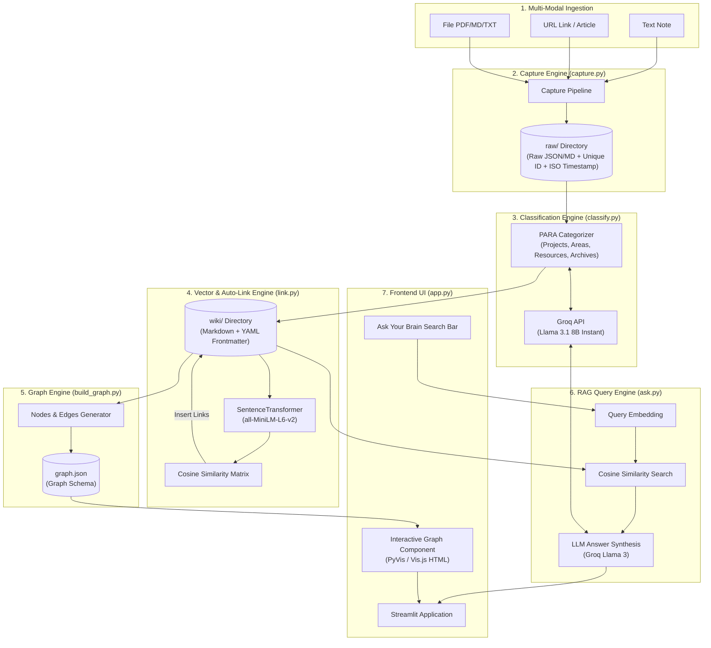
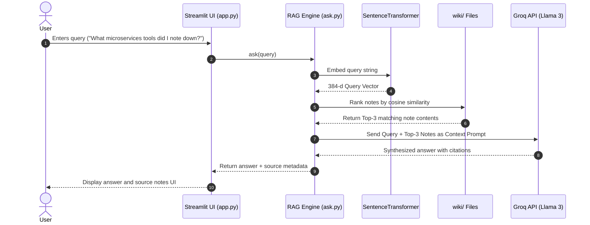

# System Architecture Document: SecondSelf (AI Second Brain)

**Project Name**: SecondSelf — Your Personal AI Second Brain  
**Version**: 1.0.0  
**Status**: Draft Architecture Specification  
**Target Platform**: Python 3.10+ / Streamlit / Streamlit Cloud / Hugging Face Spaces  

---

## 1. Executive Summary & Architectural Vision

**SecondSelf** is an end-to-end, self-organizing knowledge management system designed to eliminate the information loss associated with traditional note-taking applications. Instead of static folders or unindexed bookmarks, SecondSelf ingests multi-modal input (raw text notes, URLs, and local files), automatically classifies content using the **PARA Method** (Projects, Areas, Resources, Archives), vectorizes content to compute semantic similarity, auto-links related items, visualizes the knowledge base as an interactive force-directed graph, and enables natural language Question-Answering (RAG) over the entire accumulated knowledge base.

### Key Architectural Pillars
1. **Autonomous Classification & Structuring**: Instant semantic metadata generation (category, tags, 1-line summary) using lightweight LLMs (Groq / Llama-3).
2. **Dense Vector Auto-Linking**: Unsupervised graph edge creation based on local sentence embeddings (`sentence-transformers`), forming a self-connecting wiki.
3. **Interactive Graph Visualization**: Dynamic, interactive graph rendering (vis-network / PyVis) integrated seamlessly within a Streamlit frontend.
4. **Retrieval-Augmented Generation (RAG)**: Fast vector search + context synthesis providing verifiable answers grounded strictly in user notes.
5. **Zero-Lock-in Markdown Foundation**: Dual-storage architecture preserving raw inputs in `raw/` and refined markdown with YAML frontmatter in `wiki/`.

---

## 2. System Architecture Diagram



---

## 3. Storage & Data Schema Specifications

SecondSelf adopts a file-system-first architecture. All storage remains human-readable, portable, and git-friendly.

```
secondself/
├── raw/                      # Unprocessed raw captures
│   └── 20260729_123456_a1b2.json
├── wiki/                     # Processed markdown wiki files
│   └── 20260729_123456_a1b2.md
├── graph.json                # Exported graph node & edge data
└── embeddings.npy            # Cached vector matrix for fast retrieval
```

### 3.1 `raw/` Data Schema (`raw/{timestamp}_{id}.json`)
```json
{
  "id": "20260729_123456_a1b2",
  "timestamp": "2026-07-29T12:34:56.789Z",
  "type": "link", 
  "source": "https://example.com/article",
  "raw_content": "Full extracted text or raw note content...",
  "metadata": {
    "file_name": null,
    "file_extension": null,
    "title": "Extracted Article Title"
  }
}
```

### 3.2 `wiki/` Document Schema (`wiki/{timestamp}_{id}.md`)
```markdown
---
id: "20260729_123456_a1b2"
title: "Building Microservices with Go"
category: "Resources"
tags: ["golang", "microservices", "backend"]
summary: "A comprehensive guide to designing resilient microservices in Go using gRPC."
created_at: "2026-07-29T12:34:56.789Z"
auto_links:
  - id: "20260729_110000_f9e8"
    title: "Intro to Distributed Systems"
    similarity: 0.78
---

# Building Microservices with Go

A comprehensive guide to designing resilient microservices in Go using gRPC.

## Key Insights
...

## Related Brain Notes
- [[20260729_110000_f9e8]] - Intro to Distributed Systems (Similarity: 0.78)
```

### 3.3 Graph Schema (`graph.json`)
```json
{
  "nodes": [
    {
      "id": "20260729_123456_a1b2",
      "label": "Building Microservices with Go",
      "category": "Resources",
      "tags": ["golang", "microservices"],
      "summary": "A comprehensive guide to designing resilient microservices in Go using gRPC.",
      "value": 3
    }
  ],
  "edges": [
    {
      "from": "20260729_123456_a1b2",
      "to": "20260729_110000_f9e8",
      "weight": 0.78,
      "title": "Similarity: 78%"
    }
  ]
}
```

---

## 4. Subsystem & Module Breakdown

### 4.1 Module 1: Capture Engine (`capture.py`)
- **Responsibility**: Ingest text notes, URLs, and files, standardize the payload, assign unique IDs, and persist to `raw/`.
- **Key Functions**:
  - `generate_capture_id()`: Generates unique ID `YYYYMMDD_HHMMSS_{short_uuid}`.
  - `extract_url_content(url: str) -> str`: Uses `trafilatura` or `requests` + `BeautifulSoup` to scrape primary text content from web pages.
  - `extract_file_content(file_path: str) -> str`: Reads `.txt`, `.md`, and extracts plain text from `.pdf` files (using `pypdf` or `pdfplumber`).
  - `capture(content: str, source_type: str, source_path_or_url: str = None) -> str`: Main capture entrypoint saving JSON payload to `raw/`.

### 4.2 Module 2: Classification Engine (`classify.py`)
- **Responsibility**: Send raw captures to Groq API (Llama 3.1 8B Instant) to infer PARA category, relevant tags, and a 1-line summary.
- **PARA Categorization Definition**:
  - `Projects`: Goal-oriented tasks with dead-lines (e.g., "Build SecondSelf MVP").
  - `Areas`: Ongoing standards/responsibilities to maintain (e.g., "Health", "Financial Planning").
  - `Resources`: Topics of interest or reference materials (e.g., "Python tips", "AI Research").
  - `Archives`: Inactive items from the other three categories.
- **Key Functions**:
  - `classify_content(raw_text: str) -> dict`: Issues prompt with strict JSON schema response constraint.
  - `process_raw_to_wiki(raw_json_path: str) -> str`: Reads item from `raw/`, invokes classification, generates formatted markdown with frontmatter, and writes to `wiki/`.

### 4.3 Module 3: Vector & Auto-Link Engine (`link.py`)
- **Responsibility**: Compute sentence embeddings, calculate cosine similarity across all wiki documents, and insert bidirectional markdown links.
- **Embedding Model**: `sentence-transformers/all-MiniLM-L6-v2` (384-dimensional vector, fast CPU inference, lightweight memory footprint).
- **Auto-Linking Algorithm**:
  - Minimum similarity threshold: `THRESHOLD = 0.65`.
  - For each new or updated note $A$, compute cosine similarity $S(A, B) = \frac{A \cdot B}{\|A\| \|B\|}$ against all existing notes $B$.
  - If $S(A, B) \ge \text{THRESHOLD}$, append bidirectional links in the frontmatter and content body of both note $A$ and note $B$.
- **Key Functions**:
  - `compute_wiki_embeddings() -> dict[str, np.ndarray]`: Generates and caches embedding matrix.
  - `auto_link_wiki(threshold: float = 0.65)`: Updates all notes in `wiki/` with discovered relationships.

### 4.4 Module 4: Graph Builder & Visualization Engine (`build_graph.py` & UI)
- **Responsibility**: Parse `wiki/` notes and frontmatter auto-links, transform into nodes/edges graph schema, and render an interactive visual brain.
- **Graph Visualizer Tech**: `pyvis.network.Network` exported as HTML snippet rendered inside Streamlit via `st.components.v1.html`.
- **Node Styling Configuration**:
  - **Projects**: `#FF6B6B` (Coral Red)
  - **Areas**: `#4D96FF` (Vibrant Blue)
  - **Resources**: `#6BCB77` (Emerald Green)
  - **Archives**: `#9D9D9D` (Slate Gray)
  - Node Size: Proportional to link degree (number of connected edges).
- **Key Functions**:
  - `build_graph_json() -> dict`: Reads `wiki/` directory and outputs `graph.json`.
  - `render_interactive_graph(graph_data: dict) -> str`: Generates PyVis HTML string with custom physics, hover popups, drag, and zoom capabilities.

### 4.5 Module 5: RAG & Natural Language Query Engine (`ask.py`)
- **Responsibility**: Retrieve top-K relevant wiki notes using vector similarity and synthesize a comprehensive answer using LLM context generation.
- **Retrieval Pipeline**:
  1. Embed user prompt $Q$ via `all-MiniLM-L6-v2`.
  2. Perform cosine similarity ranking over note embeddings to find Top $K=3$ most relevant notes.
  3. Load context from selected `wiki/` files.
  4. Construct RAG prompt: *"Answer the user's question based strictly on the provided context notes. Include source references [Note Title]."*
  5. Query Groq API for synthesis.
- **Key Functions**:
  - `retrieve_context(query: str, top_k: int = 3) -> List[dict]`: Vector search over `wiki/`.
  - `ask(query: str) -> dict`: Returns synthesized answer text, retrieved note IDs, and source titles.

### 4.6 Module 6: Streamlit UI & Deployment (`app.py`)
- **Responsibility**: Single unified dashboard combining capture input, visual graph explorer, search bar, and system metrics.
- **Layout Blueprint**:
  - **Sidebar**: Quick Capture Form (Text, URL, File upload) + Pipeline Trigger ("Process & Auto-Link").
  - **Tab 1: Living Brain (Interactive Graph)**: Full-screen interactive PyVis graph view with hover cards and filter controls.
  - **Tab 2: Ask Your Brain (RAG Search)**: Search box + AI Answer box + Source note accordions.
  - **Tab 3: Wiki Explorer**: Browse categorized markdown notes.
- **Deployment Platform**: Streamlit Community Cloud / Hugging Face Spaces with environment variable `GROQ_API_KEY` configured.

---

## 5. End-to-End Data Flow Sequences

### Sequence 1: Capture, Auto-Classify, and Auto-Link Flow
```mermaid
sequenceDiagram
    autonumber
    actor User
    participant App as Streamlit UI (app.py)
    participant Cap as Capture Engine (capture.py)
    participant Class as Classifier (classify.py)
    participant LLM as Groq API (Llama 3)
    participant Link as Link Engine (link.py)
    participant Graph as Graph Builder (build_graph.py)

    User->>App: Submits Note / Link / File
    App->>Cap: capture(content, type)
    Cap->>Cap: Generate timestamp & unique ID
    Cap-->>App: Save to raw/{timestamp}_{id}.json
    
    App->>Class: process_raw_to_wiki()
    Class->>LLM: Send content for PARA & summary
    LLM-->>Class: Return JSON {category, tags, summary}
    Class-->>App: Write formatted file to wiki/{timestamp}_{id}.md

    App->>Link: auto_link_wiki()
    Link->>Link: Compute embeddings (SentenceTransformer)
    Link->>Link: Calculate similarity matrix (Cosine >= 0.65)
    Link-->>App: Update frontmatter links in wiki/*.md

    App->>Graph: build_graph_json()
    Graph-->>App: Export graph.json & update UI graph view
```

### Sequence 2: Ask Your Brain (RAG Query) Flow


---

## 6. Non-Functional Requirements & System Guarantees

| Metric / Dimension | Target / SLA | Implementation Strategy |
| :--- | :--- | :--- |
| **Capture Latency** | `< 200 ms` | Asynchronous local file writes without blocking network API calls. |
| **Classification Speed** | `< 1.5 sec` | High-throughput Groq API (`llama-3.1-8b-instant`). |
| **Embedding Speed** | `< 100 ms` per note | Local execution of `all-MiniLM-L6-v2` PyTorch/CPU ONNX model. |
| **Graph Build Speed** | `< 500 ms` (up to 500 notes) | In-memory JSON graph generation without heavy DB overhead. |
| **RAG Query Latency** | `< 2.0 sec` total | Fast embedding vector dot product + Groq streaming/fast generation. |
| **API Resilience** | 99.9% uptime fallback | Graceful degradation to keyword tagging if Groq API limit reached. |
| **Storage Portability** | 100% standard format | Markdown files usable directly in Obsidian, Logseq, or VS Code. |

---

## 7. Technology Stack Selection Matrix

| Subsystem | Framework / Library | Rationale |
| :--- | :--- | :--- |
| **Language** | Python 3.10+ | Ecosystem support for AI, embeddings, scraping, and web GUI. |
| **Frontend Framework** | Streamlit | Rapid UI development, native component support, single-file hosting. |
| **LLM Provider** | Groq API (`llama-3.1-8b-instant`) | Free tier, ultra-fast inference speed, structured JSON output. |
| **Embedding Model** | `sentence-transformers` (`all-MiniLM-L6-v2`) | Local execution, zero API cost, high-quality sentence semantic vectors. |
| **Web Extraction** | `trafilatura` + `BeautifulSoup4` | Robust main body text extraction from raw web page URLs. |
| **File Extraction** | `pypdf` / `pdfplumber` | Lightweight PDF and text extraction without heavy dependencies. |
| **Graph Visualization** | `pyvis` / `vis-network` | Dynamic force-directed interactive rendering with HTML iframe embed. |

---

## 8. Directory & File Structure Blueprint

```
secondself/
├── .streamlit/
│   └── config.toml          # Streamlit layout & theme configuration
├── raw/                      # Raw ingested captures (Week 1)
│   └── .gitkeep
├── wiki/                     # Auto-classified & linked Markdown wiki (Week 2)
│   └── .gitkeep
├── docs/                     # Project documentation
│   ├── Problem_statement.md
│   └── architecture.md
├── capture.py                # Ingestion pipeline script (Week 1)
├── classify.py               # PARA LLM classification pipeline (Week 2.1)
├── link.py                   # Sentence Transformer embedding & auto-link (Week 2.2)
├── build_graph.py            # Graph JSON & PyVis visualizer engine (Week 3)
├── ask.py                    # RAG retrieval & QA synthesis (Week 4.1)
├── app.py                    # Streamlit unified application dashboard (Week 4.2)
├── graph.json                # Exported visual graph specification
├── requirements.txt          # Production dependencies
└── README.md                 # Setup, architecture & usage instructions
```

---

## 9. Implementation Roadmap & Verification Plan

Following the 4-week milestones outlined in `Problem_statement.md`:

1. **Phase 0 (Setup)**: Directory scaffolding (`raw/`, `wiki/`), `requirements.txt` definition, environment `.env` configuration.
2. **Phase 1 (The Archivist - Week 1)**: Implement `capture.py` handling notes, URLs, and files with unique IDs & timestamps. Validate on 10+ real inputs.
3. **Phase 2 (The Librarian - Week 2)**: Build `classify.py` (Groq/PARA) & `link.py` (`all-MiniLM-L6-v2` auto-linking). Populate `wiki/` with 15+ processed items.
4. **Phase 3 (The Cartographer - Week 3)**: Implement `build_graph.py` and PyVis rendering in HTML/Streamlit. Verify force-directed layout, hover popups, and zoom/drag controls.
5. **Phase 4 (The Oracle - Week 4)**: Build `ask.py` vector retrieval & RAG answer synthesis. Integrate into `app.py` Streamlit UI.
6. **Phase 5 (Deployment & Public URL)**: Deploy to Streamlit Cloud / HF Spaces, configure secret keys, and conduct end-to-end verification.
