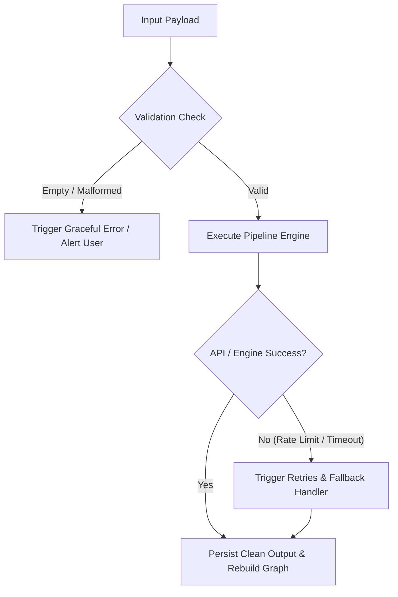

# Edge Cases & Corner Scenarios Specification: SecondSelf

**Project Name**: SecondSelf — Your Personal AI Second Brain  
**Derived From**: [docs/architecture.md](file:///g:/My%20Drive/AI/docs/architecture.md) & [docs/Implementation-plan.md](file:///g:/My%20Drive/AI/docs/Implementation-plan.md)  
**Version**: 1.0.0  

---

## Executive Overview

This document captures all anticipated failure modes, edge cases, corner scenarios, and security considerations across the **SecondSelf** pipeline. Every subsystem is designed with defensive programming, fallback mechanisms, and graceful degradation strategies to ensure system stability under unexpected inputs or environmental constraints.

---

## 1. Subsystem Edge Cases & Mitigation Matrix

### 1.1 Ingestion & Capture Engine (`capture.py`)

| Failure / Corner Scenario | Technical Cause | Defensive Handling & Mitigation | Expected System Outcome |
| :--- | :--- | :--- | :--- |
| **Empty or Whitespace Input** | User submits empty string or spaces in CLI / UI. | Validate input length `len(content.strip()) > 0`. | Return user alert: *"Capture input cannot be empty."* Prevent raw file creation. |
| **Dead / 404 / 500 URL** | Target website is offline or returns error code. | Wrap `requests`/`trafilatura` fetch in `try/except` with a 10s timeout. | Fallback: Save URL string itself as plain raw note with warning flag. |
| **Paywalled / Captcha Protected URL** | Medium, Substack, or Cloudflare JS challenge blocks scraper. | Detect low text extraction yield (`< 50 words`) or HTTP 403 response. | Store scraped HTML title + original URL note, tagging item for manual review. |
| **Password-Protected / Corrupted PDF** | `pypdf` raises `PdfReadError` or encrypted PDF exception. | Catch PDF parsing exceptions explicitly in `extract_file_content()`. | Notify user: *"PDF is encrypted or corrupted."* Log error gracefully. |
| **Massive File (e.g. 50MB PDF / 10MB Text)** | Excessive token size exceeding LLM context window. | Truncate raw content to top 15,000 characters (~3,000 tokens) for LLM classification. | Save full file in `raw/`, but pass truncated text snippet to `classify.py`. |
| **Non-UTF-8 Encoding** | Input file contains ISO-8859-1 or Windows-1252 byte sequences. | Use `chardet` or fallback encoding sequence `['utf-8', 'latin-1', 'cp1252']`. | Content successfully decoded into clean unicode text. |

---

### 1.2 Autonomous Classifier (`classify.py`)

| Failure / Corner Scenario | Technical Cause | Defensive Handling & Mitigation | Expected System Outcome |
| :--- | :--- | :--- | :--- |
| **Missing `GROQ_API_KEY`** | Key omitted from `.env` or Streamlit Cloud Secrets. | Check `os.getenv("GROQ_API_KEY")` prior to API invocation. | Raise clear Configuration Exception with setup instructions. |
| **Groq API Rate Limit (429)** | Exceeded free-tier Requests Per Minute (RPM). | Implement exponential backoff retry using `tenacity` (up to 3 retries). | Automatically pause and retry request; fallback to default category if persistent. |
| **LLM Non-JSON Response** | Llama-3 returns conversational text or markdown blocks. | Strip markdown formatting triple backticks (````json ... ````) and parse with `json.loads()`. | Extract JSON block cleanly; if invalid, trigger fallback parser. |
| **Ambiguous Classification** | 2-word input (e.g., *"buy milk"*) lacking context. | Set prompt default rule: assign to `Resources` if category confidence is low. | Document receives `category: Resources` and generic tag `#quick-note`. |
| **Groq Service Outage** | Internet down or Groq service unavailable. | Catch network connection exceptions. | Fallback classifier: Assign category `Resources`, title from first 5 words, summary from snippet. |

---

### 1.3 Dense Vector Auto-Link Engine (`link.py`)

| Failure / Corner Scenario | Technical Cause | Defensive Handling & Mitigation | Expected System Outcome |
| :--- | :--- | :--- | :--- |
| **Zero or 1 Note in Knowledge Base** | `wiki/` directory has `< 2` Markdown files. | Check note count `len(notes) >= 2` before matrix multiplication. | Skip vector auto-linking silently without division-by-zero errors. |
| **Exact Duplicate Notes (Similarity = 1.00)** | User ingests identical content twice. | Ignore self-links (`i == j`) and enforce uniqueness on linked IDs. | Prevents note from linking to itself or creating duplicate edge entries. |
| **Auto-Linking Duplicate Accumulation** | Running `link.py` multiple times appends duplicate links. | Overwrite `auto_links` frontmatter block atomically instead of appending to body text. | Frontmatter contains clean, non-repetitive relationship list. |
| **High Similarity Clutter** | Overly permissive threshold creating dense web of irrelevant edges. | Enforce strict default threshold $\ge 0.65$; cap max auto-links per note to top-5 nearest neighbors. | Graph maintains clear cluster hierarchy without becoming cluttered. |
| **Missing Model File / No Internet** | `SentenceTransformer` downloading weights offline. | Catch model download exceptions; pre-load model locally during setup. | Display model loading error notification. |

---

### 1.4 Graph Data & Visualizer (`build_graph.py`)

| Failure / Corner Scenario | Technical Cause | Defensive Handling & Mitigation | Expected System Outcome |
| :--- | :--- | :--- | :--- |
| **Isolated Unlinked Nodes** | Note has no similarities above threshold $\ge 0.65$. | Ensure node is generated with default degree `value = 1`. | Node renders as standalone pulsing point in canvas, accessible via hover. |
| **Massive Node Count (500+ Nodes)** | Browser freezing due to heavy Vis.js physics calculations. | Disable continuous physics simulation after initial stabilization (`physics: { barnesHut: { avoidOverlap: 1 } }`). | Graph stabilizes quickly without lagging browser thread. |
| **Special Characters in Hover Summary** | Double quotes `"` or HTML tags `<script>` breaking PyVis string. | Escape HTML entities in summaries using `html.escape()`. | Hover popups render clean text without breaking HTML DOM structure. |
| **Corrupted Frontmatter File** | User manually edited a Markdown file in `wiki/` with invalid YAML. | Parse frontmatter with safe fallback defaults (`yaml.safe_load`). | Assign default values (`category: Resources`) without crashing graph script. |

---

### 1.5 RAG Q&A Engine (`ask.py`)

| Failure / Corner Scenario | Technical Cause | Defensive Handling & Mitigation | Expected System Outcome |
| :--- | :--- | :--- | :--- |
| **Query Unrelated to Knowledge Base** | Question has low similarity score across all notes. | Evaluate max cosine similarity score; if `< 0.30`, bypass LLM synthesis. | Return friendly answer: *"I couldn't find any relevant notes in your brain matching this question."* |
| **Prompt Injection in Captured Notes** | Note contains malicious instruction (*"Ignore prior instructions..."*). | Isolate context notes strictly within `<context>` XML tags in LLM prompt system message. | LLM treats note text as data rather than executable instructions. |
| **Context Window Exceeded** | Retrieved top-$k$ notes combined exceed token limit. | Truncate retrieved note contents to maximum 1,000 words per note. | High-priority note snippets passed within safe LLM prompt budget. |
| **LLM Hallucination** | LLM invents facts missing from user notes. | System prompt rule: *"Answer ONLY using facts explicitly present in context notes. State if information is missing."* | Synthesized output remains strictly grounded in user notes. |

---

### 1.6 Streamlit UI & Deployment (`app.py`)

| Failure / Corner Scenario | Technical Cause | Defensive Handling & Mitigation | Expected System Outcome |
| :--- | :--- | :--- | :--- |
| **Streamlit Cloud Reboot Storage Loss** | Free hosting instances have ephemeral filesystems. | Design system to auto-rebuild `graph.json` and embeddings cache in memory on boot. | App resumes normal operation upon reboot without data corruption. |
| **Concurrent UI File Operations** | Multiple users interacting with public Streamlit app simultaneously. | Use file locks (`filelock` module) during `raw/` and `wiki/` file writes. | Prevents race conditions and partial file write corruptions. |
| **Small Mobile Viewport** | PyVis iframe clipping on mobile browsers. | Set dynamic container height `height="650px"` and responsive CSS iframe width `100%`. | Interactive graph resizes cleanly across desktop and mobile screens. |

---

## 2. Testing & Defensive Validation Strategy



1. **Unit-Level Edge Testing**: Include edge cases in test suite (empty text, malformed JSON, 404 URLs, rate-limit mocks).
2. **Sanitization Protocols**: All string outputs passed to HTML/PyVis or YAML must be sanitized via `html.escape()` and `yaml.safe_dump()`.
3. **Atomic File Writes**: Write files to temporary filenames before renaming to target paths (`wiki/{id}.tmp` $\rightarrow$ `wiki/{id}.md`) to ensure thread safety.
